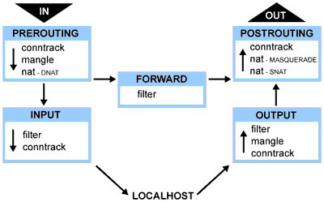

.. _iptables;:

iptables 入门
==============

iptables 介绍
----------------

  linux的包过滤功能，即linux防火墙，由 ``netfilter`` 和 ``iptables`` 两个组件组成。

  ``netfilter`` 组件也叫做内核空间，是内核的一部分，由一些信息包过滤表组成。这些表包含内核用来控制信息包过滤处理的规则集。

  ``iptables`` 组件是一种工具，也称为用户空间，它使插入、修改和除去信息包过滤表中的规则变得容易。

iptables 的结构
-----------------

  ::
    
    iptables --> Tables --> Chains --> Rules

  简单的讲，tables由chains组成，chains又由rules组成。iptables默认有四个表 **Filter** **NAT** **Mangle** **Raw** ，其包含的链如下:

    +--------------+--------------+-------------+----------+
    |Raw表         |Mangle表      |Nat表        |Filter表  |
    +==============+==============+=============+==========+
    |Prerouting链  |Prerouting链  |Prerouting链 |Input链   |
    +--------------+--------------+-------------+----------+
    |Output链      |Postrouting链 |Postrouting链|Forward链 |
    +--------------+--------------+-------------+----------+
    |              |Input链       |Output链     |Output链  |
    +--------------+--------------+-------------+----------+
    |              |Output链      |             |          |
    +--------------+--------------+-------------+----------+
    |              |Forward链     |             |          |
    +--------------+--------------+-------------+----------+

iptables 的工作流程
----------------------

  iptables 工作流程

filter 表详解
--------------

#. 在iptables 中，filter表起过滤数据包的功能，它具有以下三种内建链::

    INPUT链 - 处理来自外部的数据
    OUTPUT链 - 处理向外发送的数据
    FORWARD链 - 将数据转发到本机的其他网卡设备上

#. 数据流向场景::

     访问本机: 在INPUT链上做过滤
     本机访问外部: 在OUTPUT链上做过滤
     通过本机访问其他主机: 在FORWARD链上做过滤

#. iptables 基本操作

   * 启动iptables: ``service iptables start``
   * 关闭iptables: ``service iptables stop``
   * 重启iptables: ``service iptables restart``
   * 查看iptables状态: ``service iptables status``
   * 保存iptables配置: ``service iptables save``
   * iptables 服务配置文件: ``/etc/sysconfig/iptables-config``
   * iptables 规则保存文件: ``/etc/sysconfig/iptables``
   * 打开iptables 转发: ``echo "1" > /proc/sys/net/ipv4/ip_forward``

iptables 命令参考
-------------------

  命令::

    iptables [ -t 表名 ] 命令选项 [ 链名 ] [ 条件匹配 ] [ -j 目标动作或跳转 ]

*  表名: Filter Nat Mangle Raw 起包过滤功能的表为Filter ，可以不填，默认为Filter

*  命令选项

     ===============       =========================================
      -A                     在指定的链末尾追加一条新的规则
      -D                     删除指定链中的一条规则
      -I                     在指定的链中插入一条新的规则
      -R                     修改或替换指定链中的一条规则
      -L                     列出指定链中的所有规则
      -F                     清空指定链中的所有规则
      -N                     新建一条用户自定义的规则链
      -X                     删除指定表中用户自定义的规则链
      -P                     设置指定链的默认策略
      -n                     以数字形式显示输出结果
      -v                     查看规则列表时显示详细信息
      -V                     查看iptables 版本信息
      -h                     查看帮助信息
      --line-number          查看规则列表时，显示规则在链中的顺序号
     ===============       =========================================

* 链名

  ::
    
    INPUT链 - 处理来自外部的数据
    OUTPUT链 - 处理向外发送的数据
    FORWARD链 - 将数据转发到本机的其他网卡设备上

* 条件匹配

    条件匹配分为基本匹配和扩展匹配，扩展匹配又分为隐式扩展和显示扩展

  - 基本匹配

    =============  ======================================
     匹配参数       说明
    =============  ======================================
     -p             指定规则协议，tcp udp icmp all
     -s             指定数据包的源地址，ip hostname
     -d             指定目的地址
     -i             输入接口
     -o             输出接口
    =============  ======================================

  - 隐式扩展匹配

    +--------------+-----------+------------+----------------+
    |隐含扩展条件  |需包含     |扩展项      |说明            |
    +==============+===========+============+================+
    |-m tcp        |-p tcp     |--sport     |源端口          |
    |              |           +------------+----------------+
    |              |           |--dport     |目标端口        |
    |              |           +------------+----------------+
    |              |           |--tcp-flags |SYN ACK RST FIN |
    |              |           +------------+----------------+
    |              |           |--syn       |第一次握手      |
    +--------------+-----------+------------+----------------+
    |-m udp        |-p udp     |--sport     |源端口          |
    |              |           +------------+----------------+
    |              |           |--dport     |目标端口        |
    +--------------+-----------+------------+----------------+
    |-m icmp       |-p icmp    |--icmp-type |8:echo-request  |
    |              |           |            |0:echo-reply    |
    +--------------+-----------+------------+----------------+

  - 显示扩展匹配

   +--------------+--------------------+--------------------------------+
   |显示扩展条件  |扩展项              |说明                            |
   +==============+====================+================================+
   |-m state      |--state             |检测连接的状态                  |
   +--------------+--------------------+--------------------------------+
   |-m multiport  |--source-ports      |多个源端口                      |
   +              +--------------------+--------------------------------+
   |              |--destination-ports |多个目的端口                    |
   +              +--------------------+--------------------------------+
   |              |--ports             |源和目的端口                    |
   +--------------+--------------------+--------------------------------+
   |-m limit      |--limit             |速率(包/分钟)                   |
   +              +--------------------+--------------------------------+
   |              |--limit-burst       |峰值速率                        |
   +--------------+--------------------+--------------------------------+
   |-m connlimit  |--connlimit-above n |多个条件                        |
   +--------------+--------------------+--------------------------------+
   |-m iprange    |--src-range ip-ip   |源IP范围                        |
   +              +--------------------+--------------------------------+
   |              |--dst-range ip-ip   |目的IP范围                      |
   +--------------+--------------------+--------------------------------+
   |-m mac        |--mac-source        |mac地址限制                     |
   +--------------+--------------------+--------------------------------+
   |-m string     |--algo [bm|kmp]     |匹配算法                        |
   +              +--------------------+--------------------------------+
   |              |--string "pattern"  |要匹配的字符串                  |
   +--------------+--------------------+--------------------------------+
   |-m recent     |--name              |设定列表名称                    |
   +              +--------------------+--------------------------------+
   |              |--rsource           |源地址                          |
   +              +--------------------+--------------------------------+
   |              |--rdest             |目的地址                        |
   +              +--------------------+--------------------------------+
   |              |--set               |添加源地址的包到列表中          |
   +              +--------------------+--------------------------------+
   |              |--update            |每次建立连接都更新列表          |
   +              +--------------------+--------------------------------+
   |              |--rcheck            |检测地址是否在列表              |
   +              +--------------------+--------------------------------+
   |              |--seconds           |指定时间内，与rcheck,update共用 |
   +              +--------------------+--------------------------------+
   |              |--hitcount          |命中次数，与rcheck，update共用  |
   +              +--------------------+--------------------------------+
   |              |--remove            |在列表中删除相应地址            |
   +--------------+--------------------+--------------------------------+

 * 目标值

   数据包控制方式分为四种::

     ACCEPT:  允许数据包通过
     DROP:    直接丢弃数据包，不给出任何回应信息
     REJECT:  拒绝数据包通过，必须时会给数据发送端一个响应信息
     LOG:     在日志文件中记录日志信息，然后将数据包传递给下一条规则
     QUEUE:   防火墙将数据包移交到用户空间
     RETURN:  防火墙停止执行当前链中的后续Rules，并返回到调用链

iptables 常见命令
------------------

#. 删除iptables 现有规则

   ``iptables -F``

#. 查看iptables规则

   ``iptables -L (iptables -L -v -n)``

#. 增加一条规则到最后

   ``iptables -A INPUT -i eth0 -p tcp --dport 80 -m state --state NEW,ESTABLISHED -j ACCEPT``

#. 添加一条规则到指定位置

   ``iptables -I INPUT 2 -i eth0 -p tcp --dport 80 -m state --state NEW,ESTABLISHED -j ACCEPT``

#. 删除一条规则

   ``iptables -D INPUT 2``

#. 修改一条规则

   ``iptables -R INPUT 3 -i eth0 -p tcp --dport 80 -m state --state NEW,ESTABLISHED -j ACCEPT``

#. 设置默认策略

   ``iptables -P INPUT DROP``

#. 允许远程主机进行ssh连接

   ``iptables -A INPUT -i eth0 -p tcp --dport 22 -m state --state NEW,ESTABLISHED -j ACCEPT``

   ``iptables -A OUTPUT -o eth0 -p tcp --sport 22 -m state --state ESTABLISHED -j ACCEPT``

#. 允许本地主机进行ssh连接

   ``iptables -A INPUT -i eth0 -p tcp --sport 22 -m state --state ESTABLISHED -j ACCEPT``

   ``iptables -A OUTPUT -o eth0 -p tcp --dport 22 -m state --state NEW,ESTABLISHED -j ACCEPT``

#. 允许HTTP请求

   ``iptables -A INPUT -i eth0 -p tcp --dport 80 -m state --state NEW,ESTABLISHED -j ACCEPT``

   ``iptables -A OUTPUT -o eth0 -p tcp --sport 80 -m state --state ESTABLISHED -j ACCEPT``

#. 限制ping 192.168.146.3主机的数据包数，平均2/s，最多不能超过3个

   ``iptables -A INPUT -i eth0 -d 192.168.146.3 -p icmp --icmp-type 8 -m limit --limit 2/second --limit-burst 3 -j ACCEPT``

#. 限制ssh连接速率（默认策略是DROP）

   ``iptables -I INPUT 1 -p tcp --dport 22 -d 192.168.146.3 -m state --state ESTABLISHED -j ACCEPT``

   ``iptables -I INPUT 2 -p tcp --dport 22 -d 192.168.146.3 -m limit --limit 2/minute --limit-burst 2 -m state --state NEW -j ACCEPT``

如何正确配置iptables
----------------------

#. 删除现有规则

   ::

     iptables -F

#. 配置默认链策略

   ::

     iptables -P INPUT DROP
     iptables -P FORWARD DROP
     iptables -P OUTPUT DROP

#. 允许远程主机进行ssh连接

   ::

     iptables -A INPUT -i eth0 -p tcp --dport 22 -m state --state NEW,ESTABLISHED -j ACCEPT
     iptables -A OUTPUT -o eth0 -p tcp --sport 22 -m state --state ESTABLISHED -j ACCEPT

#. 允许本地主机进行ssh连接

   ::

     iptables -A OUTPUT -o eth0 -p tcp --dport 22 -m state --state NEW,ESTABLISHED -j ACCEPT
     iptables -A INPUT -i eth0 -p tcp --sport 22 -m state --state ESTABLISHED -j ACCEPT

#. 允许HTTP请求

   ::

     iptables -A INPUT -i eth0 -p tcp --dport 80 -m state --state NEW,ESTABLISHED -j ACCEPT
     iptables -A OUTPUT -o eth0 -p tcp --sport 80 -m state --state ESTABLISHED -j ACCEPT

使用iptables 抵御常见攻击
--------------------------

#. 防止SYN攻击

   * 限制SYN请求速度，需要设置一个合理的速度，不然会影响正常用户的请求

     ::

       iptables -N syn-flood  #新建一条规则链
       iptables -A INPUT -p tcp --syn -j syn-flood  #输入的SYN请求跳转到syn-flood规则链
       iptables -A syn-flood -m limit --limit 1/s --limit-burse 4 -j RETURN
       iptables -A syn-flood -j DROP

   * 限制单个IP的最大SYN连接数

     ::

       iptables -A INPUT -i eth0 -p tcp --syn -m connlimit --connlimit-above 15 -j DROP

#. 防止DOS攻击

   使用recent模块抵御DOS攻击::

     iptables -I INPUT -p tcp --dport 22 -m connlimit --connlimit-above 3 -j DROP  #单个IP最多连接3个会话
     iptables -I INPUT -p tcp --dport 22 -m state --state NEW -m recent --set --name SSH   #只要是新的连接请求，就把它加入到SSH列表中
     iptables -I INPUT -p tcp --dport 22 -m state --state NEW -m recent --update --seconds 300 --hitcount 3 --name SSH -j DROP  #5分钟内尝试次数达到3次，就拒绝提供SSH列表中的这个IP服务，被限制五分钟后即可恢复访问

#. 防止单个IP访问量过大

   ::

     iptables -I INPUT -p tcp --dport 80 -m connlimit --connlimit-above 30 -j DROP

#. 木马反弹

   ::

     iptables -A OUTPUT -m state --state NEW -j DROP

#. 防止ping 攻击

   ::

     iptables -A INPUT -p icmp --icmp-type echo-request -m limit --limit 1/m -j ACCEPT
